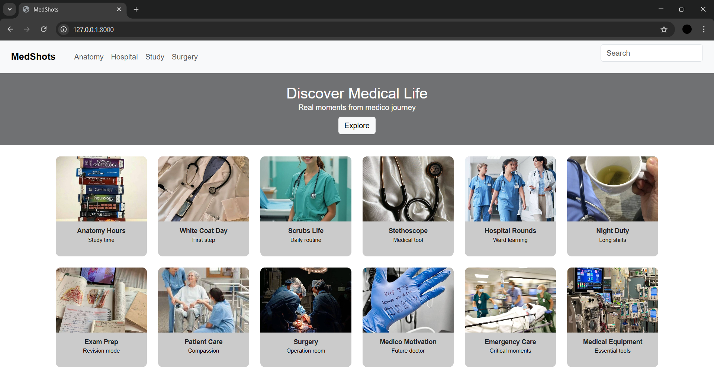

# Ex.09 Project Responsive Web Design using Bootstrap
# Date:19-12-25
# AIM:
To create a simplified clone of Dribbble (https://dribbble.com/) landing page.

# DESIGN STEPS:
## Step 1:
Clone the repository from GitHub.

## Step 2:
Create Django Admin project.

## Step 3:
Create a New App under the Django Admin project.

## Step 4:
Insert the necessary CSS and JavaScript files as external in order to use Bootstrap.

## Step 5:
Create a HTML file and include the needed Bootstrap components.

## Step 6:
Publish the website in the LocalHost.

# PROGRAM :
medico.html
```

<html>
<head>
    <title>MedShots</title>
    <link href="https://cdn.jsdelivr.net/npm/bootstrap@5.3.3/dist/css/bootstrap.min.css" rel="stylesheet">
    <link rel="stylesheet" href="">
</head>

<body>

<nav class="navbar px-4 bg-light">
    <a class="navbar-brand fw-bold" href="#">MedShots</a>

    <ul class="navbar-nav flex-row ms-4">
        <li class="nav-item me-3"><a class="nav-link" href="#">Anatomy</a></li>
        <li class="nav-item me-3"><a class="nav-link" href="#">Hospital</a></li>
        <li class="nav-item me-3"><a class="nav-link" href="#">Study</a></li>
        <li class="nav-item me-3"><a class="nav-link" href="#">Surgery</a></li>
    </ul>

    <form class="d-flex ms-auto">
        <input class="form-control" type="search" placeholder="Search">
    </form>
</nav>

<section class="text-center p-3 text-white">
    <h2>Discover Medical Life</h2>
    <p>Real moments from medico journey</p>
    <button class="btn btn-light">Explore</button>
</section>

<div class="container my-4">
    <div class="row row-cols-6 g-4">

        <div class="col">
            <div class="card">
                
                <div class="card-body">
                    <b>Anatomy Hours</b>
                    <p class="small">Study time</p>
                </div>
            </div>
        </div>

        <div class="col">
            <div class="card">
                
                <div class="card-body">
                    <b>White Coat Day</b>
                    <p class="small">First step</p>
                </div>
            </div>
        </div>

        <div class="col">
            <div class="card">
                
                <div class="card-body">
                    <b>Scrubs Life</b>
                    <p class="small">Daily routine</p>
                </div>
            </div>
        </div>

        <div class="col">
            <div class="card">
                
                <div class="card-body">
                    <b>Stethoscope</b>
                    <p class="small">Medical tool</p>
                </div>
            </div>
        </div>

        <div class="col">
            <div class="card">
                
                <div class="card-body">
                    <b>Hospital Rounds</b>
                    <p class="small">Ward learning</p>
                </div>
            </div>
        </div>

        <div class="col">
            <div class="card">
                
                <div class="card-body">
                    <b>Night Duty</b>
                    <p class="small">Long shifts</p>
                </div>
            </div>
        </div>

        <div class="col">
            <div class="card">
                
                <div class="card-body">
                    <b>Exam Prep</b>
                    <p class="small">Revision mode</p>
                </div>
            </div>
        </div>

        <div class="col">
            <div class="card">
                
                <div class="card-body">
                    <b>Patient Care</b>
                    <p class="small">Compassion</p>
                </div>
            </div>
        </div>

        <div class="col">
            <div class="card">
                
                <div class="card-body">
                    <b>Surgery</b>
                    <p class="small">Operation room</p>
                </div>
            </div>
        </div>

        <div class="col">
            <div class="card">
                
                <div class="card-body">
                    <b>Medico Motivation</b>
                    <p class="small">Future doctor</p>
                </div>
            </div>
        </div>

        <div class="col">
            <div class="card">
                
                <div class="card-body">
                    <b>Emergency Care</b>
                    <p class="small">Critical moments</p>
                </div>
            </div>
        </div>

        <div class="col">
            <div class="card">
                
                <div class="card-body">
                    <b>Medical Equipment</b>
                    <p class="small">Essential tools</p>
                </div>
            </div>
        </div>

    </div>
</div>

<script src="https://cdn.jsdelivr.net/npm/bootstrap@5.3.3/dist/js/bootstrap.bundle.min.js"></script>
</body>
</html>
```
CSS.css
```
body {
    background-color: #ffffff;
    font-family: Arial, sans-serif;
}
.navbar {
    border-bottom: 1px solid #ddd;
}
section {
    background-color: #707173;
    height: 155px;
    display: flex;
    flex-direction: column;
    justify-content: center;
    align-items: center;
}
section p {
    margin: 0;
    margin-bottom: 8px;        
}
h2{
    height: 30px;
    margin-bottom: 8px;
}

.card {
    border: none;
    border-radius: 10px;
    overflow: hidden;
    background-color:  #cbcbcb;
}
.card img {
    height: 140px;
    object-fit: cover;
}
.card-body {
    text-align: center;
    padding: 10px;
}
.card-body b {
    font-size: 14px;   
}
.card-body p {
    font-size: 12px;
    color: rgb(0, 0, 0);  
}
```
views.py
```
from django.shortcuts import render

def medshots(request):
    return render(request, 'medico.html')

```
urls.py 
```
from django.urls import path
from medd import views

urlpatterns = [
    path('', views.medshots, name='medshots'),
]

```

# OUTPUT:


# RESULT:
The Project for responsive web design using Bootstrap is completed successfully.
